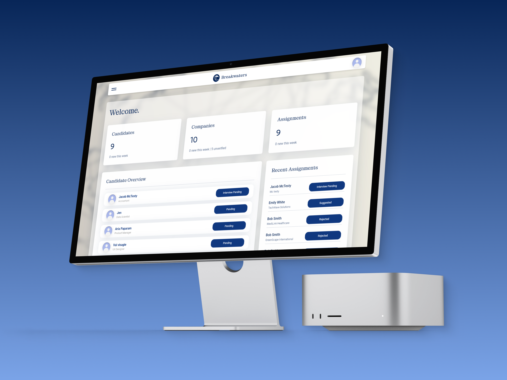
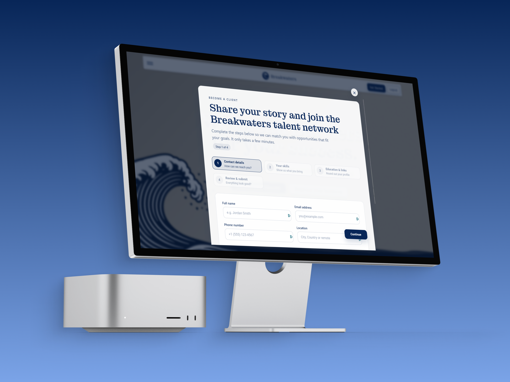
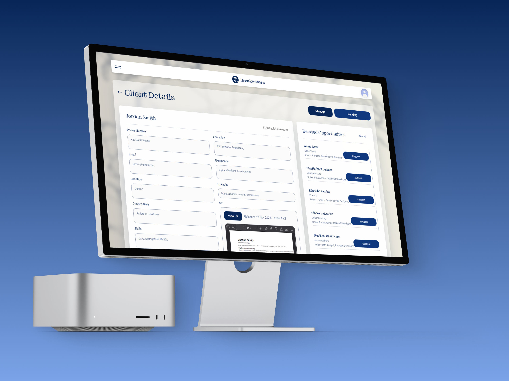
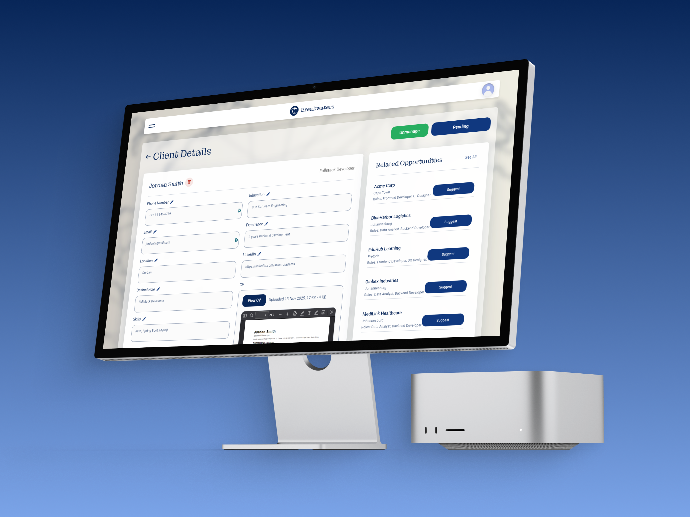
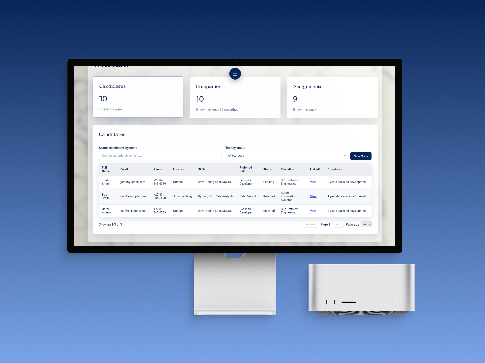

# Breakwaters Recruitment Platform

> A human centered recruitment management system that connects qualified candidates with verified companies.

<p align="center">
  
  
  
  
</p>

<p align="center">
  
  
  
  
</p>

<p align="center">
  
  
  
  
</p>

---

## 2.1 Project Header

### Project title block

- **Name:** Breakwaters Recruitment Platform  
- **Type of digital solution:** Full stack web application  
- **Primary purpose:** Manage the recruitment lifecycle from client intake to company placement  
- **Author:** Keagan Boucher  

### Table of contents

1. [2.1 Project Header](#21-project-header)  
2. [2.2 About The Project](#22-about-the-project)  
3. [2.3 Getting Started](#23-getting-started)  
4. [2.4 Project Features](#24-project-features)  
5. [2.4 Development Process](#24-development-process)  
6. [2.5 Final Outcome](#25-final-outcome)  
7. [2.6 Conclusion](#26-conclusion)  
8. [2.7 Footer](#27-footer)

---

## 2.2 About The Project

### Short project description

Breakwaters is a recruitment management platform that helps agencies match job seekers with verified companies in a transparent and structured way. Clients submit their CVs through a guided intake flow and recruitment officers review and assign candidates to companies through an internal dashboard. The system tracks status changes so that the team can see where a candidate is in the process, from first contact to interview and placement.

The aim is to move away from generic job boards and toward a curated, human centered process where recruitment officers remain in control of the matching, but are supported by clear tools and consistent data.

### Built with

- React and React Router  
- Node.js and Express  
- MySQL (Hostinger managed database)  
- JWT and bcrypt for authentication and role based access control  
- Axios for API requests  
- Cloudflare R2 for CV storage  
- Nodemailer with Hostinger SMTP for email notifications  

### Core UI mockups

<p align="center">
  
  
</p>

<p align="center">
  
  
</p>

---

## 2.3 Getting Started

All repositories require installation instructions. This section explains how to clone and run the project locally.

### Prerequisites

- Node.js 18 or higher  
- npm or yarn  
- MySQL Server 8 or compatible Hostinger database  
- Cloudflare R2 bucket and credentials  
- Hostinger account for hosting and SMTP mail  

### How to install

1. **Clone the repository**

   ```bash
   git clone https://github.com/KeaganCB-OW/breakwaters-website.git
   cd breakwaters-website
   ```

2. **Install dependencies**

   ```bash
   # Backend
   cd server
   npm install

   # Frontend
   cd ../client
   npm install
   ```

3. **Environment configuration**

   Create a `.env` file in the `server` folder with values similar to:

   ```env
   DB_HOST=your-hostinger-db-host
   DB_PORT=3306
   DB_USER=your-db-user
   DB_PASS=your-db-password
   DB_NAME=breakwaters
   DB_SSL=true

   JWT_SECRET=your-jwt-secret
   TOKEN_EXPIRY=1d
   BCRYPT_ROUNDS=12
   CLIENT_ORIGIN=http://localhost:3000

   MAIL_HOST=smtp.hostinger.com
   MAIL_PORT=587
   MAIL_SECURE=false
   MAIL_USER=no-reply@yourdomain.com
   MAIL_PASS=your-mail-password
   MAIL_FROM="Breakwaters <no-reply@yourdomain.com>"

   APP_URL=http://localhost:3000

   S3_BUCKET=your-r2-bucket
   S3_ACCOUNT_ID=your-account-id
   S3_ACCESS_KEY_ID=your-access-key
   S3_SECRET_ACCESS_KEY=your-secret-key
   S3_REGION=auto
   CV_SIGNED_URL_TTL=900
   ```

   Create a `.env` file in the `client` folder:

   ```env
   VITE_API_URL=http://localhost:5000
   VITE_APP_NAME=Breakwaters Recruitment Platform
   VITE_ENABLE_ANALYTICS=false
   ```

4. **Run the project**

   ```bash
   # Terminal 1 - backend API
   cd server
   npm run dev

   # Terminal 2 - frontend client
   cd client
   npm start
   ```

The frontend runs on `http://localhost:3000` and the API on `http://localhost:5000` by default.

If you separate your backend and frontend into different repositories for deployment, you can link to the other repository here as part of the installation steps.

---

## 2.4 Project Features

### Main features and functionality

#### Public client flow

- Public facing intake form that collects personal details, skills, and career preferences.  
- CV upload flow that stores PDFs in Cloudflare R2 and links them to the correct client profile.  
- Automated email confirmation on successful CV submission (where configured).  

#### Recruitment officer dashboard (currently implemented)

- Dashboard that lists new and in progress clients with filters for status and company.  
- Ability to review client details, view CVs, verify information, and update candidate statuses.  
- Assignment tools that link clients to registered companies and track those assignments over time.  
- Optional activity logging so that important actions such as status changes or assignments can be audited later.

#### Platform and security

- JWT based authentication with bcrypt hashed passwords and role based access control.  
- MySQL database design that separates users, clients, companies, CVs, and assignments.  
- Clear separation between React frontend and Express backend for easier maintenance and deployment.

#### Planned / future features

- Dedicated company representative dashboard to view assigned candidates.  
- Richer analytics for recruitment performance and candidate pipelines.  
- Smarter recommendation tooling for matching candidates to company requirements.

### Feature mockup

<p align="center">
  
  
</p>

<p align="center">
  
</p>

---

## 2.4 Development Process

This section documents the design and technical decisions made while building the system.

### Architecture overview

The platform uses a classic three layer structure:

- **Frontend:** React single page application that handles routing, forms, and dashboards.  
- **API layer:** Express server that exposes REST endpoints for authentication, clients, companies, CVs, and assignments.  
- **Database:** MySQL schema with separate tables for users, clients, companies, CVs, assignments, and optional activity logs.

### Data design

The database is normalised so that a single `users` record links either to a `clients` profile or a `companies` profile. Relationships handle many CVs per client and many assignments between clients and companies.

#### ERD diagram

<p align="center">
  
</p>

### Key implementation notes

- Authentication routes issue JWTs and store hashes instead of plain text passwords.  
- Middleware checks roles before allowing access to sensitive endpoints like client lists or assignment management.  
- CV uploads are handled through a dedicated endpoint that streams files to Cloudflare R2 and stores metadata in the `cvs` table.  
- Nodemailer integrates with Hostinger SMTP to send status updates when officers change candidate states or assign clients to a company.  
- The client uses Axios for API calls and React context to manage authentication state and user roles across the app.

---

## 2.5 Final Outcome

### Demonstration video

A walkthrough of the deployed application is available here:

- [Breakwaters Recruitment Platform walkthrough](https://drive.google.com/file/d/1_ypvovtx7XAwqgLDi4TmZw9sYt58C3Oh/view?usp=sharing)

### Deployed application

Live site:

- https://breakwatersrecruitment.co.za/

---

## 2.6 Conclusion

Breakwaters started as a response to common problems in recruitment workflows, such as scattered candidate data, unverified companies, and poor visibility of candidate progress. The final application provides a central place where recruitment officers can collaborate around the same information and move candidates through a clear, trackable process. Building the platform involved balancing UX decisions with security considerations, especially around how CVs and personal data are stored and accessed.

During development, the main challenges included configuring secure file storage with Cloudflare R2, integrating Hostinger SMTP with Nodemailer, and managing role based access without making the experience feel heavy or complex. These challenges informed the architecture and led to clearer route structures, better environment configuration, and more robust error handling.

Future improvements could include in app messaging between candidates and recruiters, more detailed analytics for recruitment performance, and AI assisted matching that suggests candidates to companies based on skills and role requirements.

---

## 2.7 Footer

### License

This project is licensed under the **Business Source License 1.0 (BUSL-1.0)**.  
See the `LICENSE` file in the repository for the full license text and usage terms.

### Author

**Keagan Boucher**  

- GitHub: [KeaganCB-OW](https://github.com/KeaganCB-OW)  
- LinkedIn: [Keagan Boucher](https://www.linkedin.com/in/keagan-boucher-0a5820353/)

### Acknowledgements

- Hostinger for hosting the frontend, database, and SMTP services.  
- Cloudflare for providing resilient object storage through R2.  
- Render for running the backend API.  
- All lecturers and peers who provided feedback throughout the development, especially Tsungai for guidance on full stack implementation.
